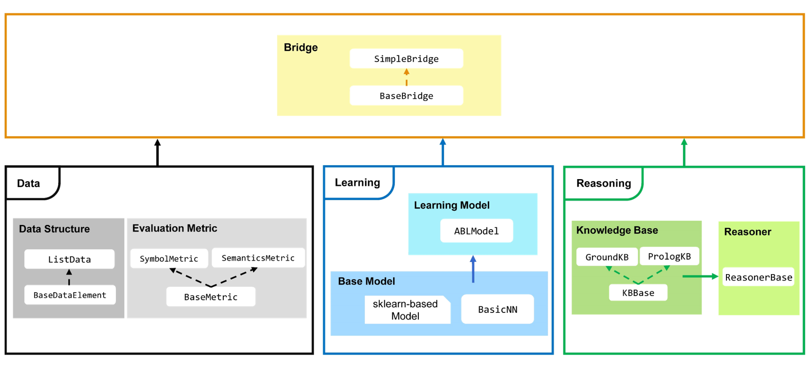
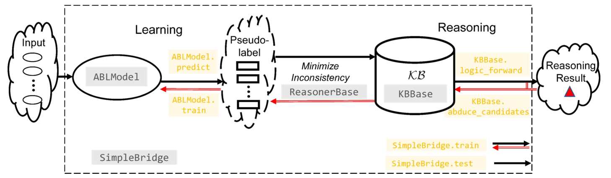

**Learn the Basics** ||
`Quick Start <Quick-Start.html>`_ ||
`Dataset & Data Structure <Datasets.html>`_ ||
`Learning Part <Learning.html>`_ ||
`Reasoning Part <Reasoning.html>`_ ||
`Evaluation Metrics <Evaluation.html>`_ ||
`Bridge <Bridge.html>`_ 

Learn the Basics
================

Modules in ABL-Package
----------------------

ABL-Package is an efficient implementation of `Abductive Learning <../Overview/Abductive-Learning.html>`_ (ABL), 
a paradigm which integrates machine learning and logical reasoning in a balanced-loop.
The ABL-Package comprises three primary parts: **Data**, **Learning**, and
**Reasoning**, corresponding to the three pivotal components of current
AI: data, models, and knowledge. Below is an overview of the ABL-Package.

**Data** part manages the storage, operation, and evaluation of data efficiently.
It includes the ``ListData`` class, which defines the data structures used in
ABL, and comprises common data operations like insertion, deletion, 
retrieval, slicing, etc. Additionally, it contains a series of evaluation metrics 
such as ``SymbolAccuracy`` and ``ReasoningMetric`` (both specialized metrics 
inherited from the ``BaseMetric`` class), for evaluating model quality from a 
data perspective.

**Learning** part focuses on the construction, deployment, and
training of machine learning models. The ``ABLModel`` class is the 
central class that encapsulates the machine learning model. This class is
compatible with various frameworks, including those based on Scikit-learn
or PyTorch neural networks constructed by the ``BasicNN`` class.

**Reasoning** part concentrates on constructing domain knowledge and 
performing reasoning. The ``KBBase`` class allows users to define a 
domain knowledge base. For diverse types of knowledge, we also offer
implementations like ``GroundKB`` and ``PrologKB`` (both inherited 
from the ``KBBase`` class). The latter, for instance, enables 
knowledge bases to be imported in the form of Prolog files.
Upon building the knowledge base, the ``Reasoner`` class is
responsible for minimizing the inconsistency between the knowledge base
and data.

The integration of these three parts are achieved through the
**Bridge** part, which features the ``SimpleBridge`` class (derived 
from the ``BaseBridge`` class). The Bridge part synthesizes data, 
learning, and reasoning, facilitating the training and testing 
of the entire ABL framework.

Use ABL-Package Step by Step
----------------------------

In a typical ABL process, as illustrated below, 
data inputs are first predicted by the learning model ``ABLModel.predict``, and the outcomes are pseudo-labels.
These labels then pass through deductive reasoning of the domain knowledge base ``KBBase.logic_forward``
to obtain the reasoning result. During training, 
alongside the aforementioned forward flow (i.e., prediction --> deduction reasoning), 
there also exists a reverse flow, which starts from the reasoning result and 
involves abductive reasoning ``KBBase.abduce_candidates`` to generate possible revised pseudo-labels. 
Subsequently, these pseudo-labels are processed to minimize inconsistencies with the learning part, 
which in turn revise the outcomes of the learning model, and then 
fed back for further training ``ABLModel.train``.  

To implement this process, the following five steps are necessary:

1. Prepare datasets

    Prepare the data's input, ground truth for pseudo-labels (optional), and ground truth for reasoning results.

2. Build the learning part

    Build a machine learning base model that can predict inputs to pseudo-labels. 
    Then, use ``ABLModel`` to encapsulate the base model.

3. Build the reasoning part

    Define a knowledge base by building a subclass of ``KBBase``, specifying how to 
    process pseudo-label examples to reasoning results.
    Also, create a ``Reasoner`` for minimizing inconsistencies 
    between the knowledge base and data.

4. Define evaluation metrics

    Define the metrics by building a subclass of ``BaseMetric``. The metrics will 
    specify how to measure performance during the training and testing of the ABL framework.

5. Bridge learning and reasoning

    Use ``SimpleBridge`` to bridge the learning and reasoning part
    for integrated training and testing. 
