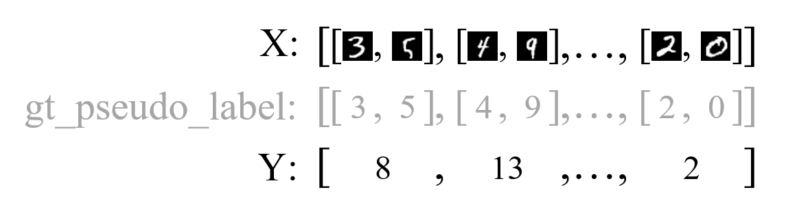

`Learn the Basics <Basics.html>`_ ||
`Quick Start <Quick-Start.html>`_ ||
**Dataset & Data Structure** ||
`Learning Part <Learning.html>`_ ||
`Reasoning Part <Reasoning.html>`_ ||
`Evaluation Metrics <Evaluation.html>`_ ||
`Bridge <Bridge.html>`_

Dataset & Data Structure
========================

In this section, we will look at the dataset and data structure in ABL Kit.

.. code:: python

    import torch
    from abl.data.structures import ListData

Dataset
-------

ABL Kit requires user data to be either structured as a tuple ``(X, gt_pseudo_label, Y)`` or a ``ListData`` (the underlying data structure utilized in ABL Kit, cf. the next section) object with ``X``, ``gt_pseudo_label`` and ``Y`` attributes. Regardless of the chosen format, the data should encompass three essential components:

- ``X``: List[List[Any]]
    
    A list of sublists representing the input data. We refer to each sublist in ``X`` as an **example** and each example may contain several **instances**.

- ``gt_pseudo_label``: List[List[Any]], optional
    
    A list of sublists with each sublist representing ground-truth pseudo-labels of an example. Each pseudo-label in the sublist serves as ground-truth for each **instance** within the example. 
    
    .. note::

        ``gt_pseudo_label`` is only used to evaluate the performance of the learning part but not to train the model. If the pseudo-label of the instances in the datasets are unlabeled, ``gt_pseudo_label`` should be ``None``.

- ``Y``: List[Any]
    
    A list representing the ground-truth reasoning result for each **example** in ``X``.

.. warning::

    The length of ``X``, ``gt_pseudo_label`` (if not ``None``) and ``Y`` should be the same. Also, each sublist in ``gt_pseudo_label`` should have the same length as the sublist in ``X``.

As an illustration, in the MNIST Addition task, the data are organized as follows:

.. |instance| image:: ../_static/img/instance.png
   :alt: alternate text
   :scale: 55%

where each sublist in ``X``, e.g., |data_example|, is a data example and each image in the sublist, e.g., |instance|, is an instance.

Data Structure
--------------

Besides the user-provided dataset, various forms of data are utilized and dynamicly generated throughout the training and testing process of ABL framework. Examples include raw data, predicted pseudo-label, abduced pseudo-label, pseudo-label indices, etc. To manage this diversity and ensure a stable, versatile interface, ABL Kit employs `abstract data interfaces <../API/abl.data.html#structure>`_ to encapsulate different forms of data that will be used in the total learning process.

``ListData`` is the underlying abstract data interface utilized in ABL Kit. As the fundamental data structure, ``ListData`` implements commonly used data manipulation methods and is responsible for transferring data between various components of ABL, ensuring that stages such as prediction, abductive reasoning, and training can utilize ``ListData`` as a unified input format. Before proceeding to other stages, user-provided datasets will be firstly converted into ``ListData``.

Besides providing a tuple of ``(X, gt_pseudo_label, Y)``, ABL Kit also allows users to directly supply data in ``ListData`` format, which similarly requires the inclusion of these three attributes. The following code shows the basic usage of ``ListData``. More information can be found in the `API documentation <../API/abl.data.html#structure>`_.

.. code-block:: python

    # Prepare data
    X = [list(torch.randn(3, 28, 28)), list(torch.randn(3, 28, 28))]
    gt_pseudo_label = [[1, 2, 3], [4, 5, 6]]
    Y = [1, 2]

    # Convert data into ListData
    data = ListData(X=X, Y=Y, gt_pseudo_label=gt_pseudo_label)

    # Get data
    X = data.X
    Y = data.Y
    gt_pseudo_label = data.gt_pseudo_label

    # Set data
    data.X = X
    data.Y = Y
    data.gt_pseudo_label = gt_pseudo_label