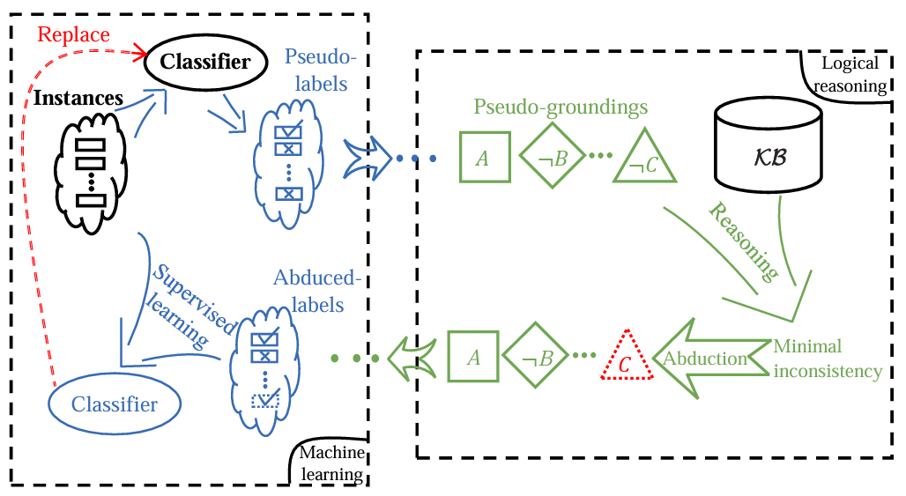

ABL-Package
===========

**ABL-Package** is an open source library for **Abductive Learning (ABL)**.
ABL is a novel paradigm that integrates machine learning and 
logical reasoning in a unified framework. It is suitable for tasks
where both data and (logical) domain knowledge are available. 

Key Features of ABL-Package:

- **Great Flexibility**: Adaptable to various machine learning modules and logical reasoning components.
- **User-Friendly**: Provide data, model, and KB, and get started with just a few lines of code.
- **High-Performance**: Optimization for high accuracy and fast training speed.

ABL-Package encapsulates advanced ABL techniques, providing users with
an efficient and convenient package to develop dual-driven ABL systems,
which leverage the power of both data and knowledge.

Installation
------------

ABL is distributed on `PyPI <https://pypi.org/>`__ and can be installed with ``pip``:

.. code:: console

    # (TODO)
    $ pip install abl

For testing purposes, you can install it using:

.. code:: console

    $ pip install -i https://test.pypi.org/simple/ --extra-index-url https://mirrors.nju.edu.cn/pypi/web/simple/ abl

Alternatively, to install ABL by source code, 
sequentially run following commands in your terminal/command line.

.. code:: console

    $ git clone https://github.com/AbductiveLearning/ABL-Package.git
    $ cd ABL-Package
    $ pip install -v -e .

(Optional) If the use of a :ref:`Prolog-based knowledge base <prolog>` is necessary, the installation of `Swi-Prolog <https://www.swi-prolog.org/>`_ is also required:

For Linux users:

.. code:: console

    $ sudo apt-get install swi-prolog

For Windows and Mac users, please refer to the `Swi-Prolog Download Page <https://www.swi-prolog.org/Download.html>`_.
