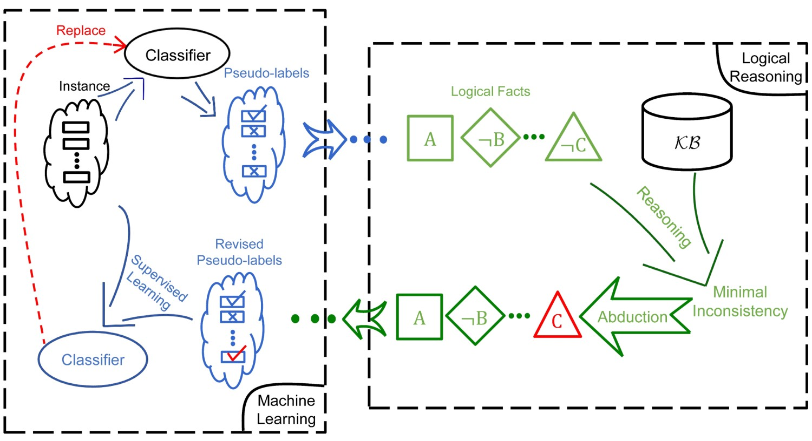

ABL-Package
===========

**ABL-Package** is an open source library for **Abductive Learning**
that supports building a model leveraging information from both data and
(logical) domain knowledge. Using ABL-Package, users may form a
dual-driven (data & knowledge driven) learning system, integrating and
balancing the use of machine learning and logical reasoning in a unified
model.

Installation
------------

ABL is distributed on PyPI and can be installed with ``pip``:

.. code:: console

   $ pip install abl

Alternatively, to install ABL by source code, download this project and 
sequentially run following commands in your terminal/command line.

.. code:: console

    $ python setup.py build
    $ python setup.py install

Releases
--------
`release 0.1`_

.. _release 0.1: https://github.com/AbductiveLearning/ABL-Package/releases/tag/v0.1