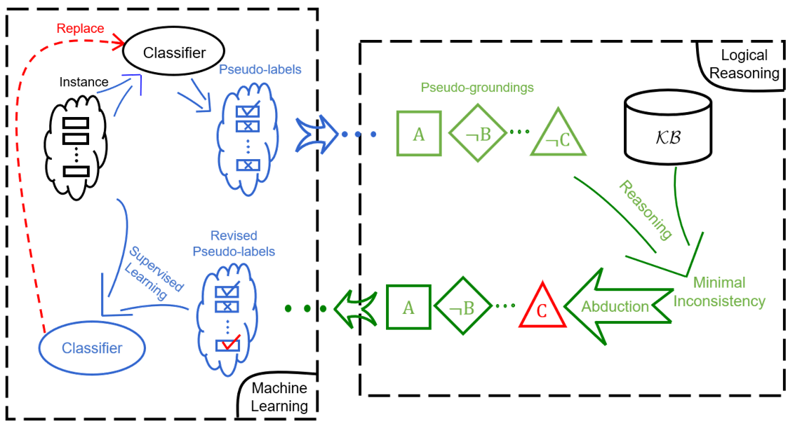

ABL-Package
===========

**ABL-Package** is an open source library for **Abductive Learning**
that supports building a model leveraging information from both data and
(logical) domain knowledge. Using ABL-Package, users may form a
dual-driven (data & knowledge driven) learning system, integrating and
balancing the use of machine learning and logical reasoning in a unified
model.

Installation
------------

ABL is distributed on `PyPI <https://pypi.org/>`__ and can be installed with ``pip``:

.. code:: console

    # (TODO)
    $ pip install abl

For testing purposes, you can install it using:

.. code:: console

    $ pip install -i https://test.pypi.org/simple/ abl

Alternatively, to install ABL by source code, 
sequentially run following commands in your terminal/command line.

.. code:: console

    $ git clone https://github.com/AbductiveLearning/ABL-Package.git
    $ cd ABL-Package
    $ pip install -v -e .
