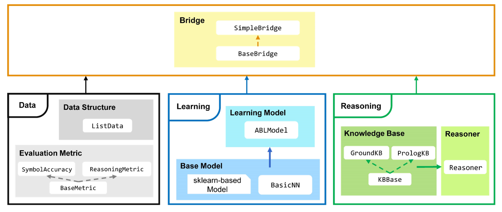

ABLkit
======

.. raw:: html

    
    

    <b>ABLkit</b> is an efficient Python toolkit for <a href="https://www.lamda.nju.edu.cn/publication/chap_ABL.pdf"><b>Abductive Learning (ABL)</b></a>.
    

ABL is a novel paradigm that integrates machine learning and 
logical reasoning in a unified framework. It is suitable for tasks
where both data and (logical) domain knowledge are available.

.. image:: _static/img/ABL.png

Key Features of ABLkit:

- **High Flexibility**: Compatible with various machine learning modules and logical reasoning components.
- **User-Friendly Interface**: Provide **data**, :blue-bold:`model`, and :green-bold:`knowledge`, and get started with just a few lines of code.
- **Optimized Performance**: Optimization for high performance and accelerated training speed.

ABLkit encapsulates advanced ABL techniques, providing users with
an efficient and convenient toolkit to develop dual-driven ABL systems,
which leverage the power of both data and knowledge.

Installation
------------

Install from PyPI
^^^^^^^^^^^^^^^^^

The easiest way to install ABLkit is using ``pip``:

.. code:: bash

    pip install ablkit

Install from Source
^^^^^^^^^^^^^^^^^^^

Alternatively, to install from source code, 
sequentially run following commands in your terminal/command line.

.. code:: bash

    git clone https://github.com/AbductiveLearning/ABLkit.git
    cd ABLkit
    pip install -v -e .

(Optional) Install SWI-Prolog
^^^^^^^^^^^^^^^^^^^^^^^^^^^^^

If the use of a :ref:`Prolog-based knowledge base <prolog>` is necessary, the installation of `SWI-Prolog <https://www.swi-prolog.org/>`_ is also required:

For Linux users:

.. code:: bash

    sudo apt-get install swi-prolog

For Windows and Mac users, please refer to the `SWI-Prolog Install Guide <https://github.com/yuce/pyswip/blob/master/INSTALL.md>`_.

References
----------

For more information about ABL, please refer to: `Zhou, 2019 <http://scis.scichina.com/en/2019/076101.pdf>`_ 
and `Zhou and Huang, 2022 <https://www.lamda.nju.edu.cn/publication/chap_ABL.pdf>`_.

.. code-block:: latex

    @article{zhou2019abductive,
        title     = {Abductive learning: towards bridging machine learning and logical reasoning},
        author    = {Zhou, Zhi-Hua},
        journal   = {Science China Information Sciences},
        volume    = {62},
        number    = {7},
        pages     = {76101},
        year      = {2019}
    }

    @incollection{zhou2022abductive,
        title     = {Abductive Learning},
        author    = {Zhou, Zhi-Hua and Huang, Yu-Xuan},
        booktitle = {Neuro-Symbolic Artificial Intelligence: The State of the Art},
        editor    = {Pascal Hitzler and Md. Kamruzzaman Sarker},
        publisher = {{IOS} Press},
        pages     = {353--369},
        address   = {Amsterdam},
        year      = {2022}
    }

.. toctree::
   :maxdepth: 1
   :caption: Overview

   Overview/Abductive-Learning
   Overview/Installation

.. toctree::
   :maxdepth: 1
   :caption: Introduction to ABLkit

   Intro/Basics
   Intro/Quick-Start
   Intro/Datasets
   Intro/Learning
   Intro/Reasoning
   Intro/Evaluation
   Intro/Bridge

.. toctree::
   :maxdepth: 1
   :caption: Examples

   Examples/MNISTAdd
   Examples/HWF
   Examples/HED
   Examples/Zoo

.. toctree::
   :maxdepth: 1
   :caption: API

   API/ablkit.data
   API/ablkit.learning
   API/ablkit.reasoning
   API/ablkit.bridge
   API/ablkit.utils

.. toctree::
   :maxdepth: 1
   :caption: References

   References

